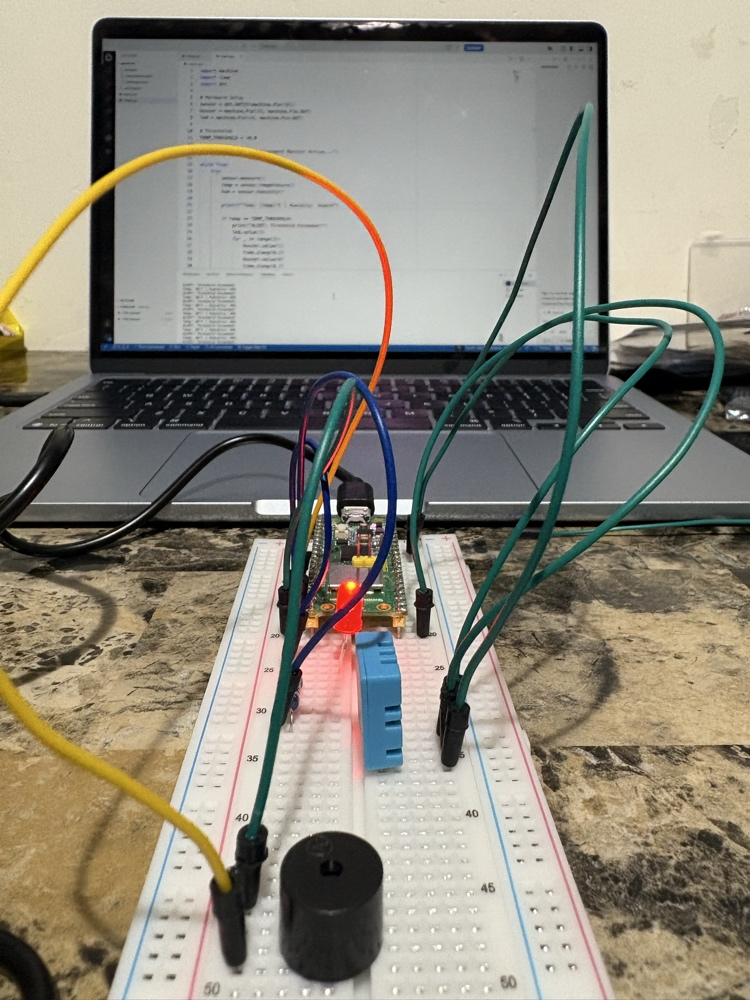

# ECE & Computer System Design Pathway Projects

Welcome to my foundational systems software repository. This portfolio tracks my progressive transition from pure programming logic to system-level architecture simulations.

---

## Project 1: Virtual LED Blink Simulator
### Overview
A pure-software simulation of a microcontroller's infinite execution loop and digital output toggling. This project bypasses physical hardware to focus entirely on the foundational programming logic used in firmware development.

### Core Concepts
* **Infinite Control Loops:** Replicating a microprocessor's main running state using `while True`.
* **State Toggling:** Utilizing Boolean variables and the `not` operator to mimic physical digital logic.

---

## Project 2: Smart Thermostat Threshold Monitor
### Overview
An environmental boundary monitoring simulation that mimics how embedded controllers process sensor data and trigger hardware safety routines (like fans or heaters) based on precise thresholds.

### Core Concepts
* **Data Parsing:** Transforming string-based terminal data inputs into integers (`int()`).
* **Conditional Branching:** Structuring discrete operational states using `if` and `elif` matching protocols.

---

## Project 3: Hexadecimal-to-Decimal Register Converter
### Overview
A data conversion utility that translates memory addresses between standard Base-10 (Decimal) and Base-16 (Hexadecimal) shorthand. This establishes essential fluency for reading hardware datasheets and register maps.

### Core Concepts
* **Base Conversion Functions:** Leveraging `hex()` to convert integers into hardware-ready string pointers.
* **Radix Decoding:** Forcing `int()` to evaluate input parameters under a Base-16 radix modifier to parse raw hex strings back into standard numerical values.

---

## Project 4: Physical Environment Monitor (Raspberry Pi Pico W)
### Overview
A bare-metal hardware telemetry system using MicroPython on a physical Raspberry Pi Pico W microcontroller. This system reads real-time ambient data and triggers an audio/visual hardware alarm state if safety thresholds are exceeded.

### Core Concepts
* **Hardware Interfacing:** Reading streaming digital data from an external sensor using specialized Python modules (`dht`).
* **GPIO Pin Manipulation:** Driving digital output pins high and low to control components like LEDs and active buzzers.
* **Persistent Boot Execution:** Naming the file `main.py` so the controller executes the script automatically on boot when running on independent power.

### Physical Circuit Setup

| Component Pin | Pico W GPIO Pin | Purpose |
| :--- | :--- | :--- |
| DHT11 VCC / + | 3V3 (Pin 36) | Power |
| DHT11 Data / OUT | GP16 (Pin 21) | Digital Telemetry |
| DHT11 GND / - | GND (Pin 38) | Ground |
| LED Anode (+) | GP14 (Pin 19) via Resistor | Visual Alarm |
| Active Buzzer (+) | GP15 (Pin 20) | Audio Alarm |

---

## How to Run
* **Run LED Blinker:** `python led_blink.py`
* **Run Thermostat:** `python smart_thermostat.py`
* **Run Register Converter:** `python hex_converter.py`
* **Run Environment Monitor:** Open VS Code, connect to the Raspberry Pi Pico W using the MicroPico extension, and run `hardware_environment_monitor.py` (or save as `main.py` for standalone power bank operation).
